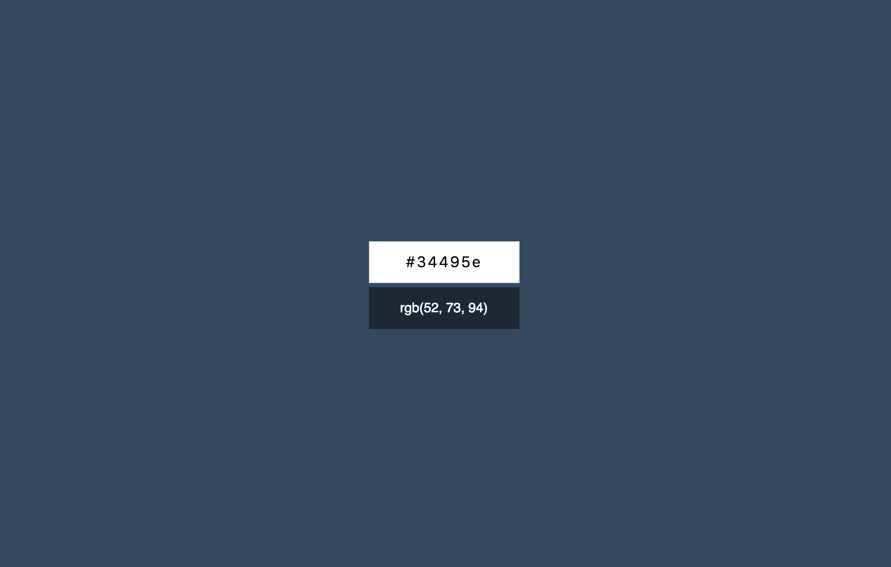

[Конвертер цветов из HEX в RGB](https://rebikhub.github.io/ra-forms-hex/)

===

Вам необходимо разработать конвертер цветов из HEX в RGB.

## Интерфейс конвертера

При правильном вводе цвета он показывает его представление в формате RGB и меняет цвет фона на заданный цвет:

Конвертер при вводе неправильного цвета в формате HEX должен сообщать об ошибке:

Необходимо дожидаться ввода всех 7-ми символов (включая решётку), чтобы принимать решение о том, показывать ошибку или менять цвет фона.